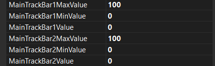

# Laba_1_Horbach

**РОЗРОБКА КОМПОНЕНТІВ**

# Мета

Вивчення особливостей створення та використання компонентів та елементів інтерфейсу користувача за допомогою середовища розробки Visual Studio, закріплення навичок об'єктно-орієнтованого програмування

# ПОСТАНОВКА ЗАВДАННЯ 

Створити додаток, який складається з двох програмних одиниць (проектів) – бібліотеки з компонентом (елементом управління) та файлу, що запускається та використовує компонент із бібліотеки. Розробити компонент шляхом наслідування та/або об'єднання декількох стандартних компонентів в один власний. Виконати його встановлення у середовище розробки Visual Studio та продемонструвати можливість повторного використання.
Основні вимоги до роботи наведені в таблиці 1.1, а варіанти функціональних вимог до компонента в таблиці 1.2 при цьому у компонента має бути як мінімум одна властивість та одна подія з рекомендованих у варіанті або запропонованих самим автором роботи. Допускається реалізація цілком власного варіанта компонента з аналогічними вимогами до складності (після обговорення з викладачем).

**Таблиця 1.1**
| № | Складність                            | Вимоги до роботи                                                                                                               | Бали | Оцінка|
|---|------------                           |--------------------------------------------------------------------------------------------------------------------------------|------|-------|
| 1 | Базовий рівень                        | Реалізація компоненту та основної програми окремими проектами в рамках одного рішення (Solution)                               |  1   |   +   |
| 2 | Базовий рівень                        | Реалізація власних властивостей та подій компонента, що відображаються в редакторі властивостей (Properties)                   |  2   |   +   |
| 3 | Базовий рівень                        | Реалізація функціональності компонента згідно завдання                                                                         |  2   |   +   |
| 4 | Підвищений рівень (самостійна робота) | Прив'язка піктограми до компонента для відображення на панелі інструментів                                                     |  1   |   +   |
| 5 | Підвищений рівень (самостійна робота) | Прив'язка меж та пропорційна зміна внутрішніх елементів щодо загального розміру компонента                                     |  1   |   +   |
| 6 | Підвищений рівень (самостійна робота) | Реалізація додаткової програми тестування в окремому рішенні (Solution) та підключення компонента через менеджер пакетів NuGet |  1   |   -   |

**Таблиця 1.2**
| №  | Призначення та функціональність компонента                                                                                       | Рекомендовані властивості            | Рекомендовані події                 |
|----|-----------------------------------------------------------------------------------------------------------------------------------|-------------------------------------|-------------------------------------|
|  5 | Два повзунки (TrackBar) для вибору інтервалу та контролем мінімального та максимального кордону: Min ≤ Max                        | мінімальне та максимальне значення  | збільшення інтервалу, зменшення інтервалу |

# Порядок виконання роботи
За допомогою діалогу створення нового проекту (меню File\New\Project або Ctrl+Shift+N) створити порожнє рішення (Blank Solution).
У створене рішення за допомогою контекстного меню додати два нові проекти (спочатку Windows Forms Application, потім Windows Forms Control Library).
Примітки:
1. Якщо порядок створення проектів було порушено, перед запуском програми необхідно вказати, що стартовим застосунком є Windows Forms Application.
2. Необхідно враховувати, що обидва проекти повинні мати однакову цільову платформу (Target Framework) і, крім цього, далі розглядається використання платформи.NET 5/6/7/8, яку слід відрізняти від платформи.Net Framework 4.x.x. При зовнішній схожості ці платформи мають багато внутрішніх відмінностей.
3. В проекті Windows Forms Control Library стандартне ім'я компонента UserControl1 поміняти на свою назву. Якщо потрібно використовувати інший базовий клас, то виконується відповідне коригування коду.
4. Додати до проекту Windows Forms Control Library піктограму (ім'я файлу має збігатися з ім'ям класу п.3).

Solution Explorer \ Add \ New Item\ Icon File

5. У редакторі піктограм додати нове зображення
New Image Type… \ 16x16, 24 біт та видалити створені за умовчанням 16х16, 4 біт; 32х32, 4 біт та ін. через контекстне меню Delete Image Type…
6. Зв'язати піктограму з компонентом, додавши код із атрибутом класу
…
ToolboxBitmap(@"drive:\fullpath\Ім'я класу.ico")
 public partial class Ім'я класу : UserControl
…
Примітка: піктограму можна створювати у форматі bitmap але обов'язково 16x16, 24 біт також вказуючи повний шлях в атрибутах:

ToolboxBitmap(@"drive:\fullpath\Ім'я класу.bmp").

8. У вікні властивостей файлу піктограми змінити властивість Build Action на Embedded Resource або Resource.
9. Виконати компіляцію всіх проектів.
10. Якщо створений компонент після компіляції не з'явиться автоматично у верхній частині вікна Toolbox, то через основне меню Tools / Options… виконати налаштування параметра автоматичного підвантаження компонентів для дизайнера віконних форм.
11. Реалізувати логіку компонента відповідно до варіанта (див. табл. 1.2), задіявши задані властивості та події. Допускається та вітається власний варіант завдання з описом функціональності компонента, його властивостей та подій.
12. Розмістити створений компонент на формі Windows Forms Application і при необхідності доопрацювати програму для тестування функціональності створеного компонента.

# ВИКОНАННЯ РОБОТИ

Зменшення інтервалу

Збільшення інтервалу

Реалізація компоненту та основної програми окремими проектами в рамках одного рішення (Solution)

Реалізація власних властивостей та подій компонента, що відображаються в редакторі властивостей (Properties)

Подія

Властивості

Прив'язка піктограми до компонента для відображення на панелі інструментів

Прив'язка меж та пропорційна зміна внутрішніх елементів щодо загального розміру компонента

# ВИСНОВОК

Під час виконання практичної було створено порожнє рішення (Blank Solution). У цьому рішенні були додані два нові проекти за допомогою контекстного меню: спочатку Windows Forms Application, а потім Windows Forms Control Library. Після створення проекту Windows Forms Control Library було внесено зміни у стандартне ім'я компонента UserControl1 на власну назву. Також було додано піктограму до проекту, ім'я файлу якої збігалося з ім'ям класу. У вікні властивостей файлу піктограми була змінена властивість Build Action на Embedded Resource або Resource. Код був змінений згідно з вимогами, зокрема додано атрибут ToolboxBitmap до класу компонента для зв'язку піктограми з компонентом. Всі проекти були скомпільовані, а після цього виконано налаштування автоматичного підвантаження компонентів для дизайнера віконних форм. Також була реалізована логіка компонента відповідно до вимог, задіявши задані властивості та події. На останньому етапі, створений компонент був розміщений на формі Windows Forms Application, і програма була доопрацьована для тестування функціональності створеного компонента.
